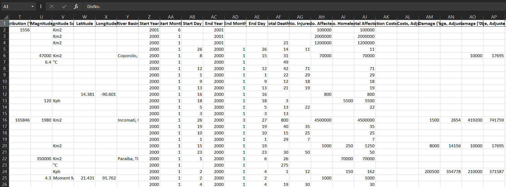
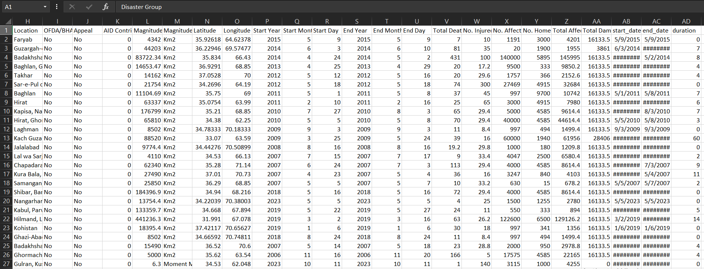

# 🌍 Global Disaster Intelligence Dashboard

An end-to-end Business Intelligence transformation of the EM-DAT International Disaster Database. This project demonstrates a shift from pure technical modeling to **decision-oriented analytics**, scaling a raw dataset from 4,700 to 22,000+ validated records.

---

## 🛠️ Data Engineering: The "80% Effort"
The core of this project was a massive data restructuring and cleaning pipeline. By splitting multi-location rows and applying a 5-tier hierarchical imputation strategy, the dataset was transformed for high-fidelity reporting.

### **Dataset Transformation (Before vs. After)**
| Raw Data (Initial State) | Engineered Data (Ready for BI) |
| :--- | :--- |
|  |  |
| *Fragmented, missing coordinates, multi-location rows.* | *Structured, geocoded, and temporally validated.* |

---

## ⚙️ Business Intelligence Framework
Reframed through a BI lens, the project follows a 4-step decision support process:

1. **Clarify the Problem:** Moving beyond raw records to understand high-impact regions and economic costs.
2. **Analytical Layers:** Dividied into KPIs (Fatalities/Loss), Geo-distribution, and YoY Trend analysis.
3. **Dimensional Modeling:** Implemented a **Star Schema** in Power BI (Fact Table + Geography, Disaster, and Calendar Dimensions).
4. **Operational Awareness:** Moving from descriptive data to actionable resource allocation insights.

---

## 🖼️ Dashboard Preview
The final dashboard provides geographic and temporal visibility into global disaster trends, answering specific business questions through structured visuals.

---

## 🔥 Key Engineering Features
* **Geospatial Recovery:** Used `Geopy` to recover missing coordinates for historical records.
* **Temporal Validation:** Ensured strict consistency between disaster start and end dates.
* **Metric Standardization:** Recalculated "Total Affected" and standardized economic loss metrics.
* **Star Schema Architecture:** Optimized for scalability, clean relationships, and accurate aggregations.

---

## 🛠️ Tech Stack
* **Data Engineering:** Python (Pandas, Geopy), EM-DAT Database
* **Visualization:** Power BI (DAX, Power Query)
* **Modeling:** Dimensional Modeling (Star Schema)

---

## 📂 Project Structure
- **`Dashboard/`**: Power BI `.pbix` file and high-res dashboard exports.
- **`Data/`**: Raw vs. Processed datasets and engineering evidence.
- **`Script/`**: Python notebooks for cleaning, geocoding, and data restructuring.

---

## 👤 Author
**Yehia Elharery**
